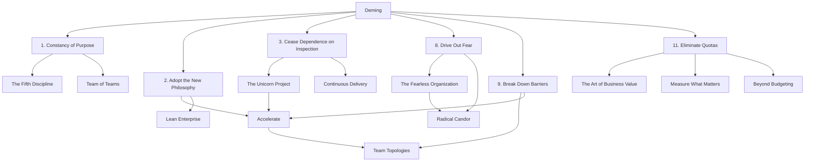
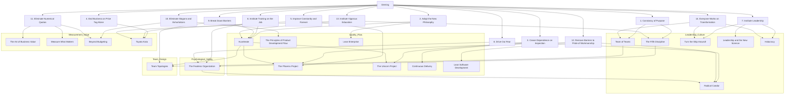

# Deming Principles Overview

Created: 2025-03-05 06:05:02
Last Updated: 2025-03-05 06:23:31

### User

*[user_editable_context content]*

### User - 2025-03-05 06:05:02

What are the key ideas from Demming's book Out of the Crisis?

### Assistant - 2025-03-05 06:05:14


### Assistant - 2025-03-05 06:05:02

Nice choice! Before we dive in, can you confidently extract key ideas from a dense management book like *Out of the Crisis* on your own? If not, I can suggest sections you might try handling yourself. If yes, I can also guide you toward more advanced insights, like how Deming's ideas evolved in modern systems thinking. Want me to help with that?

Now, to build human connection around this topic: you could invite a group of peers or leaders to read a chapter with you and discuss which of Deming's principles still hold up today. Or, you might reach out to someone experienced in Lean or Six Sigma to ask how they see Deming's work show up in practice. Sharing a thoughtful question on LinkedIn or in a work Slack about whether people still use the *14 Points* could also spark great conversations.

Here’s a brief overview of *Out of the Crisis* to ground you, along with the surrounding context:

### Context
W. Edwards Deming was pivotal in transforming post-WWII Japanese industry and is a founding figure in quality management. *Out of the Crisis* (1982) was aimed at American industry, which he felt was falling behind due to poor management practices. Deming believed that to survive, companies needed a total overhaul in thinking.

### Key Ideas
1. **14 Points for Management** – A comprehensive framework for quality and productivity, including:
   - Create constancy of purpose.
   - Adopt the new philosophy of continuous improvement.
   - Cease dependence on inspection to achieve quality.
   - Drive out fear.
   - Break down barriers between departments.
   - Eliminate slogans and targets that substitute for leadership.
   - Institute training on the job.

2. **System of Profound Knowledge** (developed more explicitly later, but present here in spirit):
   - Appreciation for a system.
   - Knowledge of variation.
   - Theory of knowledge.
   - Psychology (understanding people and motivation).

3. **Focus on Systems, Not Individuals** – Failures are usually due to the system, not the people within it. Blaming workers ignores the deeper issues in processes and leadership.

4. **The Deadly Diseases** – Seven major problems undermining organizations, such as:
   - Lack of constancy of purpose.
   - Emphasis on short-term profits.
   - Evaluation by performance, merit rating, or annual review.
   - Mobility of management.
   - Use of visible figures only.

5. **Quality as a Competitive Advantage** – Emphasizing the long-term gains from delivering consistent, high-quality products and services.

6. **Leadership Responsibilities** – Managers are responsible for creating systems where people can succeed, not just supervising them.

### Skills & Roles You'd Engage
- Systems thinking.
- Change management.
- Cross-functional collaboration.
- Data-driven decision-making (understanding variation and avoiding overreacting to normal fluctuations).
- Leadership development focused on intrinsic motivation.

To cement your learning, reflect later on where you see these principles at play (or ignored) in your workplace.

Would you like a more elegant comparison of how Deming’s ideas contrast with modern Agile or Lean approaches? And before we wrap up, want me to suggest how we could debrief this interaction?

### User - 2025-03-05 06:08:16

These are great principles but I suspect Demming's treatment will feel like it's lacking modern context. Who are authors who explore these principles from a more contemporary perspective?

### Assistant - 2025-03-05 06:08:16

Great instinct! Before I suggest authors, can you confidently identify which modern frameworks (like Lean, Agile, Systems Thinking, DevOps, etc.) are direct descendants of Deming’s principles? If not, you might try mapping a few of Deming's *14 Points* to modern practices yourself—I can suggest a few pairs to get you started.

Now for building connection: this is a rich area for starting thoughtful conversations. You could ask experienced Agile or Lean practitioners how they see Deming’s legacy show up day to day. Or, you might invite folks to reflect on which of Deming’s “Deadly Diseases” are still plaguing companies today. These make great deep-dive book club topics or Slack threads.

Here’s a brief tour of contemporary authors who expand or reframe Deming’s ideas in modern contexts:

### **Contemporary Authors Building on Deming**

#### **Lean & Systems Thinking**
- **Don Reinertsen** (*The Principles of Product Development Flow*) – Focuses on economics, queues, and variability in product development. Very Deming-like precision but applied to knowledge work.
- **Gene Kim** (*The Phoenix Project*, *The Unicorn Project*) – These fictionalized case studies show systems thinking, constraints, and flow in software orgs.
- **Mary and Tom Poppendieck** (*Lean Software Development*) – Translates Lean manufacturing principles (rooted in Deming) to software.
- **John Shook** (*Managing to Learn*) – Practical leadership stories from the Toyota Production System, where Deming’s influence is foundational.

#### **Organizational Culture & Learning**
- **Peter Senge** (*The Fifth Discipline*) – Introduces the concept of the “learning organization,” which mirrors Deming's focus on systems and continuous improvement.
- **Amy Edmondson** (*The Fearless Organization*) – Her work on psychological safety builds directly on Deming’s “drive out fear” principle.
- **David Marquet** (*Turn the Ship Around!*) – Focuses on empowering people to think and act like leaders, echoing Deming’s shift from command-and-control.

#### **Modern Quality & DevOps**
- **Nicole Forsgren, Jez Humble, and Gene Kim** (*Accelerate*) – Brings rigorous, data-driven research into the relationship between systems, leadership, and performance.
- **Mark Schwartz** (*A Seat at the Table*, *The Art of Business Value*) – Explores how IT leadership can align with business, cutting through the old siloed structures Deming criticized.

#### **Broader, Elegant Takes**
- **Russell Ackoff** – A contemporary of Deming’s who took systems thinking into organizational design and leadership in compelling ways.
- **Brian Robertson** (*Holacracy*) – Controversial, but deeply rooted in the idea of systemic, self-healing organizations.
- **Margaret Wheatley** (*Leadership and the New Science*) – Brings in complexity science and systems thinking for leadership.

### **Next Steps**
If you're game, we can:
- Map specific Deming principles to these modern works.
- Design a "reading journey" that traces Deming's influence across decades.
- Or explore where modern interpretations might even *improve* on Deming's original insights.

And before we close this out, I’d love to help us debrief. Would you like me to offer what we've each done well here, and how we might make this exchange even sharper next time?

### User - 2025-03-05 06:09:32

Let's map specific Deming principles to these works

### Assistant - 2025-03-05 06:09:33

Excellent! Before we dive in—do you feel confident trying to map a few of Deming’s *14 Points* to modern works on your own first? If not, I can suggest a few starting points for you to tackle. If yes, I can guide you toward making this more comprehensive or even visualizing it as a conceptual map. Want to give that a shot?

For connection, this mapping exercise would make a *stellar* way to build trust with thoughtful practitioners. Imagine co-creating a shared doc with peers or mentors where you each propose modern parallels to Deming’s points. Or posting your partial map in a work Slack and inviting corrections. People love the chance to teach or refine big-picture thinking like this.

### Here's a starter mapping of Deming's *14 Points* to modern works:

---

#### **1. Create constancy of purpose.**  
**Modern take:** *The Fifth Discipline* (Senge) – Building a shared vision.  
**Also:** *A Seat at the Table* (Schwartz) – Aligning IT with enduring business value.

#### **2. Adopt the new philosophy.**  
**Modern take:** *Accelerate* (Forsgren et al.) – Embracing continuous delivery as a competitive necessity.  
**Also:** *Lean Software Development* (Poppendiecks).

#### **3. Cease dependence on inspection to achieve quality.**  
**Modern take:** *The Unicorn Project* (Kim) – Shift left testing, continuous integration.  
**Also:** *The Principles of Product Development Flow* (Reinertsen) – Managing variability through system design, not heroics.

#### **4. End the practice of awarding business on price tag alone.**  
**Modern take:** *Managing to Learn* (Shook) – Investing in long-term supplier relationships.  
**Also:** *Lean Thinking* (Womack & Jones).

#### **5. Improve constantly and forever.**  
**Modern take:** *The Phoenix Project* (Kim) – Continuous improvement through iterative learning.  
**Also:** *Turn the Ship Around!* (Marquet) – Empowering everyone to identify improvements.

#### **6. Institute training on the job.**  
**Modern take:** *Accelerate* – High-performing teams emphasize learning cultures.  
**Also:** *The Fearless Organization* (Edmondson) – Creating space where learning is safe.

#### **7. Institute leadership.**  
**Modern take:** *Leadership and the New Science* (Wheatley) – Leading as part of the system, not over it.  
**Also:** *Turn the Ship Around!*.

#### **8. Drive out fear.**  
**Modern take:** *The Fearless Organization*.  
**Also:** *The Unicorn Project* – Cultural transformation through safety and trust.

#### **9. Break down barriers between departments.**  
**Modern take:** *Accelerate* – Cross-functional collaboration is a top predictor of success.  
**Also:** *Team Topologies* (Skelton & Pais) – Designing teams for flow.

#### **10. Eliminate slogans, exhortations, and targets.**  
**Modern take:** *The Principles of Product Development Flow* – Focus on systemic solutions, not heroism or pressure.

#### **11. Eliminate numerical quotas and management by objective.**  
**Modern take:** *The Art of Business Value* (Schwartz) – Contextual understanding over metrics obsession.  
**Also:** *Beyond Budgeting* (Bogsnes) – Dynamic, decentralized performance systems.

#### **12. Remove barriers to pride of workmanship.**  
**Modern take:** *The Phoenix Project* – Reducing toil and allowing people to do meaningful work.  
**Also:** *Lean Software Development* – Eliminating waste to focus on value.

#### **13. Institute a vigorous program of education and self-improvement.**  
**Modern take:** *Accelerate* – Psychological safety and ongoing learning are essential for high performance.  
**Also:** *The Fifth Discipline*.

#### **14. Put everyone to work to accomplish the transformation.**  
**Modern take:** *Turn the Ship Around!* – Leader-leader models where everyone contributes.  
**Also:** *Holacracy* (Robertson) – Radical delegation of authority.

---

Would you like to extend this? We could:
- Fill in missing modern texts.
- Turn this into a table or concept map.
- Identify weak spots where modern practice *hasn't* picked up Deming's insights as fully.

And at the end of this, don’t forget to reflect on where you see these in your own org—and if you want, we can debrief how we worked together on this. Want to do that?

### User - 2025-03-05 06:14:40

Let's fill in missing modern texts and then turn this into a concept map

### Assistant - 2025-03-05 06:14:40

Love it! Before we continue—are you comfortable identifying missing areas in this mapping on your own first? If not, I can suggest some specific gaps for you to work on. If yes, I can help you make the map richer with alternative schools of thought, or even guide you in designing a shareable visual for others. Want to push into that?

To build trust and connection, this concept map is a perfect artifact to co-develop with peers. You could open-source it in a public doc or Notion and invite contributions from Lean, Agile, and DevOps communities. You might even host a session where people debate the best modern representations of each principle, deepening everyone's understanding—and making you the thoughtful connector who brought it to life.

---

### Step 1: Filling in missing modern texts  

Here's a more complete pass, adding fresh texts, viewpoints, or areas that might have been thin:

---

#### **1. Create constancy of purpose.**  
- *The Fifth Discipline* (Senge)  
- *Team of Teams* (McChrystal) – Aligning around shared purpose in complex environments.

#### **2. Adopt the new philosophy.**  
- *Accelerate* (Forsgren et al.)  
- *Lean Enterprise* (Humbl e, Molesky, O'Reilly) – Embedding experimentation as a core philosophy.

#### **3. Cease dependence on inspection to achieve quality.**  
- *The Unicorn Project* (Kim)  
- *Continuous Delivery* (Humble & Farley) – Automate quality into the process.

#### **4. End the practice of awarding business on price tag alone.**  
- *Managing to Learn* (Shook)  
- *Toyota Kata* (Rother) – Focus on learning relationships, not transactions.

#### **5. Improve constantly and forever.**  
- *The Phoenix Project* (Kim)  
- *Toyota Kata* (Rother) – Daily improvement habits.

#### **6. Institute training on the job.**  
- *Accelerate*  
- *Resilient Management* (Hogan) – Coaching as everyday practice.

#### **7. Institute leadership.**  
- *Leadership and the New Science* (Wheatley)  
- *Team of Teams* (McChrystal)

#### **8. Drive out fear.**  
- *The Fearless Organization* (Edmondson)  
- *Radical Candor* (Scott) – Psychological safety + direct feedback.

#### **9. Break down barriers between departments.**  
- *Accelerate*  
- *Team Topologies* (Skelton & Pais)

#### **10. Eliminate slogans, exhortations, and targets.**  
- *The Principles of Product Development Flow* (Reinertsen)  
- *Beyond Budgeting* (Bogsnes)

#### **11. Eliminate numerical quotas and management by objective.**  
- *The Art of Business Value* (Schwartz)  
- *Measure What Matters* (Doerr) – Cautionary lessons on OKRs.

#### **12. Remove barriers to pride of workmanship.**  
- *The Phoenix Project*  
- *Drive* (Pink) – Autonomy, mastery, purpose.

#### **13. Institute a vigorous program of education and self-improvement.**  
- *Accelerate*  
- *The Fifth Discipline*  
- *Continuous Learning Culture* (various modern Agile texts).

#### **14. Put everyone to work to accomplish the transformation.**  
- *Turn the Ship Around!*  
- *Holacracy* (Robertson)  
- *Team of Teams* (McChrystal)

---

### Step 2: Turn this into a concept map  

Would you like:
1. **A hierarchical concept map** (Deming → 14 Points → modern works)?
2. **A network map** showing cross-linkages (e.g., how *Accelerate* connects to multiple points)?
3. **A visual timeline** showing how these works emerged historically as continuations of Deming?

Once you pick, I can help you sketch the structure and suggest tools (like Miro, Excalidraw, or even Mermaid.js for code-based diagrams).

And when we wrap, let's remember to reflect on what we learned from doing this, and how you might use this artifact to build relationships in your network. Want me to help with that, too?

### User - 2025-03-05 06:21:11

A network map

### Assistant - 2025-03-05 06:21:12

Perfect! A **network map** is an excellent choice—it reveals the rich, overlapping influence across ideas and authors, just like the complex systems Deming wanted us to understand.

Before we dive into sketching it:  
Do you feel confident using a tool like **Miro**, **Excalidraw**, or **Obsidian Canvas** to build this kind of concept map? If not, I can suggest small starter steps you can own, like plotting just a few nodes and connections. If yes, I can guide you toward more elegant layouts or scalable structures you can keep growing over time. Want that?

To build human connection: This network map becomes an incredible artifact to *share and invite contribution*. You could:
- Post an early draft in a Slack community or LinkedIn and ask: *“What modern works best represent Deming’s 14 Points today? Here’s what I’ve got so far—what would you add?”*
- Run a virtual session with colleagues to co-create it live.
- Reach out directly to authors like Gene Kim or Nicole Forsgren and see if they’d comment (they’re often very engaged with community efforts like this!).

---

### How to structure the network map

#### **Nodes:**
- Central node: **Deming**
- 14 sub-nodes: **The 14 Points** (these will serve as primary anchors).
- Modern works as additional nodes, connected to all the points they support.
- Optional: Nodes for **core themes** like *Systems Thinking*, *Psychological Safety*, *Continuous Improvement* to show shared concepts.

#### **Edges (connections):**
- Link each modern work to the Deming Points it addresses.
- Thicker or colored edges for stronger relationships (like *The Fearless Organization* with *Drive out fear*).
- Cross-links between modern works that complement or reference each other (like *Accelerate* and *The Phoenix Project*).

#### **Example fragment of the map:**

```
[Deming]
  |
  --> [Drive out fear]
        |       \
        |        --> [The Fearless Organization]
        |
        --> [Radical Candor]
  --> [Break down barriers between departments]
        |
        --> [Team Topologies]
        --> [Accelerate]
```

#### **Suggested Tools:**
- **Miro** – Great for collaborative, flexible maps.
- **Excalidraw** – Simple, hand-drawn feel.
- **Obsidian Canvas** – Best if you want this tied to your personal notes and knowledge graph.
- **Kumu.io** – If you want an elegant, web-friendly map with rich metadata.
- **Mermaid.js** – If you want something you can version control and generate programmatically.

Would you like me to:
- Generate an initial Mermaid.js template for the map?
- Sketch a simple text-based draft you can paste into a tool?
- Recommend layouts or aesthetics to keep it readable as it grows?

And when we’re done, want to do a debrief on how we each contributed and what could make the work even sharper?

### User - 2025-03-05 06:21:56

Generate a mermaid.js map

### Assistant - 2025-03-05 06:21:56

Fantastic choice! Before I generate the Mermaid.js map—are you confident modifying Mermaid code on your own to expand or style it? If not, I can suggest a few small sections you could maintain yourself while I scaffold the rest. If yes, I can also guide you toward making it more elegant, with clustering, interactivity, or better graph layout techniques. Want me to offer that?

As you develop this map, it's a prime opportunity to share drafts publicly and invite feedback from both Deming purists and modern practitioners. Seeing their reactions (and corrections) can build real trust and mutual respect.

---

### Here's a **starter Mermaid.js network map** to get you going:



---

### How to grow this:
- **Add the other 14 Points** (I included just a subset to keep this clean).
- **Cross-link modern works** that complement each other.
- **Use subgraphs** to cluster works around major themes like *Leadership*, *Quality*, or *Learning Organizations*.
- **Play with Mermaid styles** if you want to color code by era, school of thought, or degree of influence.

### Next steps:
Would you like me to:
- Expand this to include all 14 Points and more modern works?
- Add styling guidance (colors, line styles)?
- Show how to embed this in Notion, Obsidian, or another tool?

And before we finish, shall we do a debrief? I'd love to reflect together on what worked in this collaboration and what might make future work even sharper. Want to do that?

### User - 2025-03-05 06:22:50

Expand this to add the full set of points and more works and group things into subgraphs 

### Assistant - 2025-03-05 06:22:50

Great, expanding the full map and grouping by thematic clusters will make this network both richer and easier to navigate. Before I generate the full expanded Mermaid.js map:  

Are you comfortable managing Mermaid’s **subgraph syntax** and keeping the code clean as it grows? If not, you might take responsibility for just one subgraph (like *Psychological Safety*) while I scaffold the rest. If yes, I can show you elegant patterns like dynamic grouping or modular Mermaid files for maintainability. Want to explore that?

And for connection-building, once you have this expanded map, posting it as a *"living artifact"*—something you're intentionally seeking input on—can help you build credibility and relationships with both experienced practitioners and newer learners eager to engage. Maybe invite a small review group to critique and expand it with you.

---

### Expanded Mermaid.js Network Map with Full Points and Grouped Subgraphs  



---

### Why this works:
- **Subgraphs** group works thematically but let nodes stay connected across categories (like *Radical Candor* in both *Leadership* and *Psych Safety*).
- **Cross-links** show synergy between modern texts.
- **Full 14 Points** are represented and connect directly to relevant works.

---

### Next steps:
1. **Visual polish:** Add colors, shapes, or line styles if your Mermaid renderer supports them.
2. **Scalability:** If this grows further, we can modularize sections or add labels to connections.
3. **Publishing:** Embed it in a doc, share it in public forums, and actively request critiques and contributions.

Would you like:
- Styling guidance?
- Suggestions for where to share and collaborate on this?
- To debrief our process and reflect on how we worked together here?

