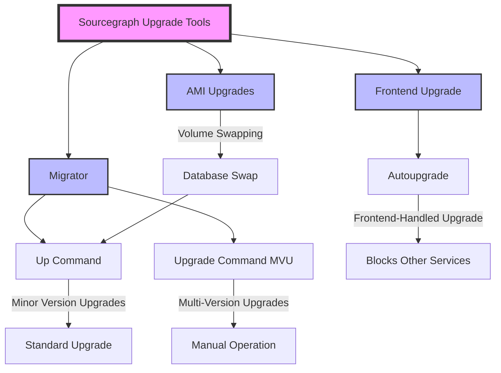

# Flowchart Upgrade Tools

Created: 2024-09-12 16:06:52
Last Updated: 2024-09-12 16:07:03

### User - 2024-09-12 16:06:52

Render this
graph TD
    A[Sourcegraph Upgrade Tools]
    A --> B[Migrator]
    A --> C[Frontend Upgrade]
    A --> D[AMI Upgrades]

    B --> E[Up Command]
    B --> F[Upgrade Command MVU]

    C --> G[Autoupgrade]

    E -->|Minor Version Upgrades| H[Standard Upgrade]
    F -->|Multi-Version Upgrades| I[Manual Operation]
    G -->|Frontend-Handled Upgrade| J[Blocks Other Services]

    D -->|Volume Swapping| K[Database Swap]
    K --> E

    style A fill:#f9f,stroke:#333,stroke-width:4px
    style B fill:#bbf,stroke:#333,stroke-width:2px
    style C fill:#bbf,stroke:#333,stroke-width:2px
    style D fill:#bbf,stroke:#333,stroke-width:2px

### Assistant - 2024-09-12 16:07:02

### Assistant - 2024-09-12 16:07:02

It seems like you're working with a diagram using Mermaid syntax, which describes a flow of various components and processes related to upgrading tools. Here's a visual representation of the flowchart you provided using Mermaid's text syntax.

This will create a flowchart where:
- The central node is "Sourcegraph Upgrade Tools" with three main branches: Migrator, Frontend Upgrade, and AMI Upgrades.
- Various processes and relationships are linked, with custom styles applied to the main node and branches.

You can use this code in a platform or tool that supports Mermaid to render the actual diagram.

