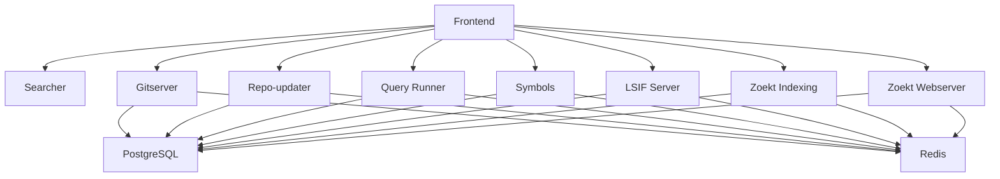

# Linux Code Base Structure

Created: 2023-10-22 06:29:43
Last Updated: 2023-10-22 07:18:54

### User - 2023-10-22 06:29:43

What is the structure of the Linux code base?

### Assistant - 2023-10-22 06:29:53

The Linux code base is vast and complex, but here's a concise breakdown of its structure:

1. **Kernel Root Directory**:
    - **arch/**: Architecture-specific code (x86, ARM, MIPS, etc.).
    - **block/**: Block I/O layer code, for things like disk drives.
    - **crypto/**: Cryptographic infrastructure and algorithms.
    - **Documentation/**: Documentation for various kernel subsystems and APIs.
    - **drivers/**: Device drivers.
        * **drivers/net**: Network drivers.
        * **drivers/char**: Character device drivers.
        * **drivers/block**: Block device drivers, and so on.
    - **fs/**: Filesystem code (ext4, vfat, btrfs, etc.).
    - **include/**: Header files.
    - **init/**: Kernel initialization code.
    - **ipc/**: Inter-process communication code.
    - **kernel/**: Core kernel code (scheduler, time management, etc.).
    - **lib/**: Helper functions and libraries used throughout the kernel.
    - **mm/**: Memory management.
    - **net/**: Networking code.
    - **samples/**: Sample code.
    - **scripts/**: Utility scripts for tasks like configuration, kernel building, etc.
    - **security/**: Security modules and infrastructure.
    - **sound/**: Sound subsystem.
    - **tools/**: Various tools.
    - **usr/**: Code to generate an initial CPIO archive.
    - **virt/**: Virtualization infrastructure.

2. **Configuration and Build Files**:
    - **Kconfig**: Files that define configuration options.
    - **Makefile**: Files used to compile the kernel.

3. **Miscellaneous**:
    - **.git/**: If you've cloned the kernel from its git repository, this directory contains git metadata.

This structure can change slightly between kernel versions, but this gives a general idea of where to find specific components. If you're interested in delving deeper into the Linux kernel, it's a good idea to pick up a book on Linux kernel development or browse the source code directly, as it comes with a lot of inline comments to help understand its workings.

### User - 2023-10-22 06:31:13

Give a narrative architectural overview of Linux that is suitable for first year computer science major

### Assistant - 2023-10-22 06:31:29

Certainly! Here's a narrative architectural overview of the Linux operating system tailored for a first-year computer science major:

---

Imagine Linux as a grand mansion, built with the collective effort of architects from around the world. This mansion is open for everyone to visit, adapt, and even replicate. In the heart of this mansion lies the **Kernel**—the essential core that makes everything work.

1. **Foundation (Hardware Layer)**:
   The mansion is built upon solid ground, representing the physical hardware—computers, phones, servers, and more. Just like how different mansions can be built on different terrains, Linux can run on various hardware platforms: from personal computers and mobile phones to supercomputers.

2. **Basement (Architecture-specific Code)**:
   In the basement, labeled **`arch/`** in our mansion's blueprint, are rooms designed specifically for different types of foundations—like x86 for most personal computers or ARM for mobile devices. These rooms ensure that the mansion stands strong, regardless of the terrain.

3. **Main Floor (Core Kernel)**:
   As you enter the mansion, you encounter rooms like **`kernel/`** and **`init/`**, which form the heart of the building. These rooms coordinate all activities, from deciding which task should proceed next to managing time.

4. **Utility Rooms (Drivers)**:
   There are several utility rooms, known as **`drivers/`**, filled with tools and equipment. Each tool represents a driver, allowing the mansion to interact with external elements like printers, displays, and USB devices.

5. **Storage Rooms (File Systems)**:
   There's a vast storage area called **`fs/`**. Here, different types of shelves and cabinets represent various file systems, like ext4 or NTFS, which determine how data is stored and organized.

6. **Communication Passages (Networking and IPC)**:
   There are corridors, labeled **`net/`** and **`ipc/`**, that allow inhabitants to communicate. Whether they want to chat within the mansion or with those in neighboring buildings (other devices on a network), these passages make it possible.

7. **Guard Rooms (Security)**:
   To ensure the mansion's safety, there are guard rooms under **`security/`**. These rooms ensure that only authorized individuals can enter specific areas and that everyone behaves properly.

8. **Recreational Areas (User Space)**:
   Beyond the core mansion, there's a vast garden representing the **User Space**. Here, people enjoy various activities using applications and software. These applications rely on the mansion's facilities, but they're not part of the core building.

---

In essence, Linux is a meticulously designed structure that efficiently coordinates between the hardware and the software, ensuring that everything runs smoothly. Just like in a mansion where every brick and room has a purpose, in Linux, every line of code plays a crucial role. And the beauty of it all? The blueprints (source code) are open for everyone to study, modify, and improve!

### User - 2023-10-22 06:32:10

Give a narrative architectural overview of Linux that is suitable for an early career professional programmer. It should describe the architecture directly and not use cute metaphors 

### Assistant - 2023-10-22 06:32:28

Certainly! Here's a direct architectural overview of the Linux operating system tailored for an early career professional programmer:

---

**Linux**, at its core, is a Unix-like operating system kernel, and its architecture is designed to manage hardware resources, provide services to user space applications, and ensure security and access control.

1. **Kernel Mode vs. User Mode**:
   - Linux operates in two modes: kernel mode and user mode. The kernel mode has unrestricted access to the system's hardware, while user mode is a restricted mode in which applications run.

2. **System Architecture (Hardware Layer)**:
   - Linux is designed to be portable across various hardware architectures, like x86, ARM, MIPS, and more. Each architecture has its dedicated code in the **`arch/`** directory.

3. **Core Kernel**:
   - **Initialization**: Initiated by the **`init/`** directory, this sets up the system after booting.
   - **Scheduler**: Manages task scheduling, deciding which process runs when, and for how long.
   - **Memory Management**: Found in **`mm/`**, it handles virtual memory, page mapping, and memory allocation.
   - **Process Management**: Manages processes and threads, including creation, scheduling, and termination.

4. **Device Drivers**:
   - Residing in the **`drivers/`** directory, drivers are modules that allow the kernel to interact with hardware devices. These are categorized into subdirectories like **`drivers/net/`** for network devices, **`drivers/char/`** for character devices, etc.

5. **File Systems**:
   - The **`fs/`** directory contains code for managing various file systems (e.g., ext4, NFS). It enables operations like read, write, and data organization on storage devices.

6. **Networking**:
   - The **`net/`** directory manages all networking protocols and operations. It facilitates communication over various protocols like TCP/IP, ensuring data can be sent and received over networks.

7. **Inter-process Communication (IPC)**:
   - Found in the **`ipc/`** directory, IPC mechanisms allow processes to communicate and synchronize with each other, using tools like semaphores, message queues, and shared memory.

8. **Security**:
   - The kernel provides security mechanisms, and the **`security/`** directory hosts various security modules, ensuring controlled access to system resources.

9. **System Calls**:
   - System calls are interfaces through which user space applications request services from the kernel. Examples include creating processes, opening files, and networking operations.

10. **User Space**:
   - This is where applications and libraries run. Though not part of the kernel, user space interacts heavily with it through system calls.

11. **Kernel Modules**:
   - These are pieces of code that can be loaded into or unloaded from the kernel on demand, allowing for extensibility and modularity without rebooting the system.

---

In essence, the Linux kernel is a bridge between software applications and the physical hardware of a computer. Its architecture is modular and extensible, designed to manage and abstract complexities of hardware for user space applications, ensuring a consistent environment for software to operate.

### User - 2023-10-22 06:34:22

Give a narrative architectural overview of Linux that is suitable for a second year computer science major. It should describe the architecture directly and not use cute metaphors 

### Assistant - 2023-10-22 06:34:45

Absolutely, here's a narrative architectural overview of the Linux operating system tailored for a second-year computer science major:

---

**Linux** is a monolithic, Unix-like kernel, and it serves as the heart of various operating systems such as Ubuntu, Fedora, and Android. Let's dive into its architecture:

1. **Kernel Mode vs. User Mode**:
   - All code executed by the Linux kernel runs in kernel mode with full access to hardware resources, whereas user mode is a restricted processing mode for user applications. System calls serve as a controlled bridge between these two.

2. **System Architecture**:
   - The **`arch/`** directory holds architecture-specific code, supporting diverse hardware platforms (e.g., x86, ARM, MIPS). This ensures Linux's portability across devices from smartphones to supercomputers.

3. **Core Kernel**:
   - **Initialization**: **`init/`** contains the routines to start the system post-boot.
   - **Process Management**: Linux provides comprehensive process management, supporting multitasking with process scheduling, creation, termination, and more.
   - **Memory Management**: Encapsulated in **`mm/`**, Linux manages virtual memory, swap space, and memory allocation, ensuring efficient use of RAM.

4. **Device Drivers**:
   - Located in **`drivers/`**, these are essential modules allowing the kernel to interface with hardware. They are segmented by device type, such as **`drivers/net/`** for networking or **`drivers/char/`** for character devices.

5. **File Systems**:
   - Inside **`fs/`**, Linux accommodates multiple file systems (like ext4, btrfs, or NFS). This modular approach enables reading, writing, and other operations on various storage devices.

6. **Networking**:
   - The **`net/`** directory oversees networking operations. Linux supports a myriad of protocols like TCP/IP, UDP, and ICMP, facilitating robust networking capabilities.

7. **Inter-process Communication (IPC)**:
   - In **`ipc/`**, Linux offers mechanisms for processes to interact—semaphores, shared memory, message queues, etc., enabling synchronization and data sharing.

8. **Security**:
   - The kernel embeds security features. With the help of the **`security/`** directory, modules like SELinux or AppArmor can be utilized to enforce access controls and policies.

9. **System Calls**:
   - These are predefined interfaces that user applications employ to request services from the kernel, be it for I/O operations, process management, or networking.

10. **Modules**:
   - Kernel's modularity is emphasized through kernel modules. They can dynamically add or remove functionality, allowing for on-the-fly modifications without needing a reboot.

11. **User Space**:
   - Although external to the kernel, user space is crucial. It consists of applications, utilities, and libraries that leverage kernel services but run in a restricted environment, shielded from direct hardware access.

---

To summarize, the Linux kernel efficiently abstracts and manages hardware intricacies, offering a stable platform for software. It is a culmination of modular, extensible components, ensuring adaptability across various use cases.

### User - 2023-10-22 06:37:38

Give a narrative overview of the memory management module that is suitable for a second year computer science major. It should describe the architecture directly and not use cute metaphors 

### Assistant - 2023-10-22 06:38:04

Certainly! Let's delve into the memory management module of the Linux kernel:

---

**Memory Management in Linux**:

Memory management is one of the kernel's most crucial functionalities, ensuring efficient utilization of the computer's RAM, providing memory protection and isolation, and abstracting the hardware details from higher-level software components.

1. **Virtual Memory**:
   - Linux uses a virtual memory system, which provides processes with the illusion that they have access to a large, continuous block of memory. This abstraction simplifies memory operations and provides isolation between processes.
   - This system divides memory into pages, typically 4KB in size (though this can vary based on the architecture).

2. **Page Tables**:
   - To map virtual memory to physical memory, Linux utilizes page tables. These tables translate virtual addresses used by applications into actual physical memory addresses.
   - The MMU (Memory Management Unit) hardware often assists in this translation, speeding up the process.

3. **Page Frame Allocator**:
   - Whenever the kernel needs a new physical page, it consults the page frame allocator. This subsystem tracks which pages are free and allocates them as necessary.

4. **Buddy System**:
   - Linux often employs the "buddy system" for memory allocation, wherein memory blocks are grouped into lists of sizes that are powers of two. This method helps to combat fragmentation.

5. **Slab Allocator**:
   - For smaller, frequently-used data structures (like inode or dentry objects), Linux uses the slab allocator. It caches and groups these structures to ensure quick allocations and minimal memory waste.

6. **Swapping**:
   - When RAM is nearing capacity, Linux can move infrequently accessed memory pages to disk space, called swap space. This process ensures that more crucial or frequently used data can remain in RAM. Though this aids in managing memory under heavy load, accessing pages from swap is significantly slower than accessing them from RAM.

7. **Memory Zones**:
   - Physical memory is categorized into zones, reflecting hardware constraints. Common zones are:
     * **ZONE_DMA**: For devices that can only access lower parts of memory.
     * **ZONE_NORMAL**: Regularly used for most system operations.
     * **ZONE_HIGHMEM**: For memory that isn't permanently mapped into the kernel's address space, used in systems with a significant amount of RAM.

8. **Memory Policies**:
   - Linux supports NUMA (Non-Uniform Memory Access), where memory access times can differ. Memory policies decide which node's memory to use in such systems.

9. **Overcommit Handling**:
   - Linux can "promise" more memory than is available (overcommit), speculating that not all processes will use their allocated memory simultaneously. If all processes claim their promised memory, the OOM (Out of Memory) killer takes action, selecting processes to terminate and free up memory.

10. **mmap and kmalloc**:
   - **mmap** is used to map files or devices into memory, often utilized for shared memory or memory-mapped file I/O.
   - **kmalloc** is the primary method used within the kernel to allocate memory chunks.

11. **HugePages**:
   - For performance optimization, especially in databases or large-scale simulations, Linux supports "huge pages," which are much larger than the standard 4KB pages, reducing the overhead of managing and translating many small pages.

---

In essence, Linux's memory management is a blend of various techniques and systems, ensuring efficient memory utilization, isolation, and flexibility across a wide array of workloads and hardware configurations.

### User - 2023-10-22 06:39:55

Give a narrative architectural overview of sourcegraph/sourcegrapg that is suitable for a second year computer science major. It should describe the architecture directly and not use cute metaphors 

### Assistant - 2023-10-22 06:40:20

Certainly! As of my last update in January 2022, Sourcegraph is a self-hosted platform used for code search and navigation across multiple repositories. Let's dive into its architecture:

---

**Sourcegraph Architecture**:

1. **Frontend**:
   - This is the main entry point for users interacting with Sourcegraph.
   - It serves the web interface, which is built using a combination of TypeScript and React.
   - The frontend also handles authentication, API gateway functionality, and serves as a router to other services.

2. **Searcher**:
   - Handles code search requests.
   - When you enter a query in Sourcegraph, the frontend forwards the search to one or more `searcher` instances which scan Git repositories and return matches. These are then rendered in the frontend.

3. **Repo-updater**:
   - Manages the list of repositories.
   - It ensures that the git repositories Sourcegraph knows about are always up to date with their upstream counterparts.

4. **Gitserver**:
   - Houses the git services.
   - It manages operations that need direct access to Git repositories, like fetching and cloning repositories, computing file histories, etc.

5. **Query Runner**:
   - Used for running saved searches.

6. **Symbols**:
   - Provides ctags-based symbol information for repositories.
   - When you look for function or method definitions in a repository, the `symbols` service helps find them.

7. **LSIF Server**:
   - Handles precise code intelligence requests via the Language Server Index Format (LSIF).
   - Unlike the more general search capabilities, LSIF provides fast and precise code navigation operations, but it requires repositories to be pre-indexed.

8. **PostgreSQL & Redis**:
   - Sourcegraph uses PostgreSQL for most of its persistent storage needs.
   - Redis is used for caching and other tasks that require a fast, ephemeral data store.

9. **Management Console**:
   - A separate frontend used for editing critical configuration, ensuring these edits are made securely and don't lead to system outages.

10. **Zoekt Indexing & Zoekt Webserver**:
   - These are parts of Sourcegraph's indexed search system. 
   - "Zoekt" focuses on performance and scalability, allowing Sourcegraph to quickly search over large numbers of repositories. 
   - The `zoekt-indexing` component ensures data is indexed, while `zoekt-webserver` serves the actual search queries.

---

The above components communicate via a combination of HTTP-based APIs and direct database access. The overall architecture is designed for modularity and scalability, allowing Sourcegraph to efficiently search, navigate, and manage large volumes of code across many repositories.

Please note that while this provides a general overview of Sourcegraph's architecture as of early 2022, software evolves, and there might be changes or additions to the platform after this time. Always refer to Sourcegraph's official documentation or GitHub repository for the most up-to-date information.

### User - 2023-10-22 07:17:51

Provide an architecture diagram

### Assistant - 2023-10-22 07:18:03

I'm sorry for the inconvenience, but I cannot create detailed visual diagrams. However, I can provide a textual representation or a description on how you might structure one. If you'd like to create an architecture diagram for Sourcegraph based on the information provided:

1. **Canvas**:
   Start with a large canvas, perhaps labeled "Sourcegraph Architecture".

2. **Main Blocks**:
   - Place a central block for the `Frontend`.
   - Surround the `Frontend` block with blocks representing `Searcher`, `Repo-updater`, `Gitserver`, `Query Runner`, `Symbols`, `LSIF Server`, `Zoekt Indexing`, and `Zoekt Webserver`.

3. **Database Blocks**:
   - Below or to the side, depict two separate blocks for `PostgreSQL` and `Redis`.

4. **Connections**:
   - Draw arrows from the `Frontend` block to most other blocks, representing communication or API calls.
   - Indicate direct database access with arrows from the main service blocks to the `PostgreSQL` and `Redis` blocks.

5. **Annotations**:
   - Provide brief annotations next to each block or arrow to indicate its purpose or the nature of the communication.

Once you have the textual layout, you can use tools like draw.io, Lucidchart, or even Microsoft Visio to create a visual representation.

### User - 2023-10-22 07:18:43

Can you give an architectural diagram in mermaid.js of sourcegraph

### Assistant - 2023-10-22 07:18:54

Certainly! Here's a basic architecture diagram for Sourcegraph in Mermaid.js format. This is a textual representation based on the previously mentioned components:

You can copy and paste this code into a Mermaid live editor or integrate it into a tool that supports Mermaid to visualize the architecture diagram. This provides a basic understanding of how components in Sourcegraph might relate to each other, but do note that it's a simplified view and doesn't represent every interaction or component.

