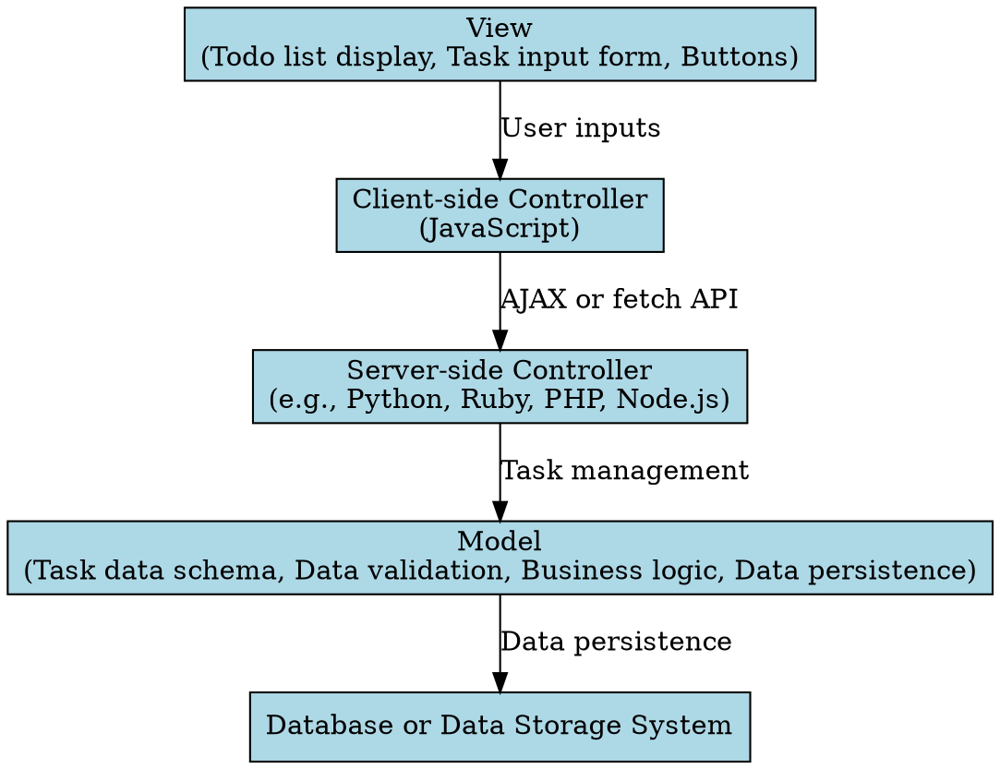

# MVC software design pattern.

Created: 2023-04-20 21:27:46
Last Updated: 2023-04-20 21:35:16

### User - 2023-04-20 21:27:46

Explain the model view controller pattern

### Assistant - 2023-04-20 21:28:25

The Model-View-Controller (MVC) pattern is a software design pattern that promotes the separation of concerns in software applications. It divides the application into three interconnected components, each with a specific responsibility:

1. Model: The Model represents the underlying data structure and the business logic of the application. It is responsible for retrieving, storing, and processing data, as well as managing the application's state. The Model is also responsible for notifying the View of any changes in the data so that it can update the user interface accordingly.

2. View: The View represents the user interface (UI) and the presentation of the data. It is responsible for displaying the data from the Model and capturing user inputs. The View does not have any knowledge of the business logic or the data processing; it only communicates with the Controller, which handles those aspects.

3. Controller: The Controller acts as an intermediary between the Model and the View. It processes user inputs from the View, updates the Model as necessary, and communicates changes back to the View. The Controller is responsible for managing the application's workflow and coordinating the interactions between the Model and the View.

Benefits of the MVC pattern include:

1. Separation of concerns: By dividing the application into distinct components, the MVC pattern promotes modularity and maintainability. Each component can be developed, tested, and modified independently of the others.

2. Reusability: The separation of concerns allows for reusing components in different parts of the application or even in other applications. For example, a View component can be used with different Models or Controllers.

3. Easier testing and debugging: With each component handling a specific responsibility, it becomes easier to test and debug individual components in isolation.

4. Scalability: The MVC pattern makes it easier to scale an application, as each component can be scaled independently to meet the needs of the application.

The MVC pattern is commonly used in web applications, mobile apps, and desktop applications. It is supported by many programming languages and frameworks, such as Ruby on Rails, Django, Angular, and ASP.NET.

### User - 2023-04-20 21:29:10

Give an example of how this could be applied in a client server architecture. 

### Assistant - 2023-04-20 21:30:01

In a client-server architecture, the client is the user interface or front-end that communicates with a server, which handles data processing and storage. The MVC pattern can be applied in a client-server architecture by distributing the Model, View, and Controller components across the client and server. Here's an example using a web application:

1. Model: The Model resides on the server-side and manages the application's data and business logic. It interacts with a database or another data storage system to retrieve, store, and process data. The server-side code is usually written in languages like PHP, Python, Ruby, Java, or Node.js. The Model may also expose APIs (Application Programming Interfaces) to allow the client-side to interact with the data and business logic.

2. View: The View is part of the client-side, which runs in the user's web browser. It is responsible for displaying the data and capturing user inputs. The View is usually built using HTML, CSS, and JavaScript. The client-side JavaScript can interact with the server-side Model through AJAX (Asynchronous JavaScript and XML) or fetch API calls, which allows the browser to communicate with the server without requiring a page reload.

3. Controller: The Controller can be split between the client and server-side. On the client-side, the Controller processes user inputs and communicates with the server-side Model using AJAX or fetch API calls. It may also handle some minor data manipulation and validation before sending it to the server. On the server-side, the Controller processes the data received from the client-side, updates the Model as needed, and returns the updated data or status back to the client-side. The server-side Controller is usually written in the same language as the Model.

Here's a simple example using a web-based task management application:

- The user accesses the task management application in their web browser (the View).
- The user adds a new task through the application's UI, which triggers the client-side Controller.
- The client-side Controller validates the task input and sends a request to the server-side Controller to create the new task.
- The server-side Controller processes the request, interacts with the Model to store the new task in the database, and returns a response indicating success or failure.
- The client-side Controller receives the response, updates the View with the new task, and provides feedback to the user.

By applying the MVC pattern in a client-server architecture, you can create a modular and maintainable application that can be easily updated, scaled, and tested.

### User - 2023-04-20 21:31:13

Continuing with the same example, give an example of logic which would live in the model vs the controller vs the view

### Assistant - 2023-04-20 21:32:09

In the context of a web-based task management application, let's see what kind of logic would typically be placed in the Model, View, and Controller components:

Model:
- Data schema: The Model would define the data structure for tasks, such as title, description, due date, priority, status (e.g., incomplete, in progress, completed), and any relationships with other data objects, like users or projects.
- Data validation: The Model would enforce data validation rules, such as ensuring that the task title is not empty, the due date is a valid date, and the priority is within an acceptable range.
- Data persistence: The Model would handle interactions with the database or data storage system, including creating, reading, updating, and deleting tasks.
- Business logic: The Model would contain any business-related rules or logic, such as calculating the progress of a project based on completed tasks or determining overdue tasks based on their due dates.

Controller:
- Input validation: The server-side Controller would perform input validation and sanitization to ensure that the received data from the client-side is safe and meets expectations before interacting with the Model.
- Authentication and authorization: The Controller would manage user authentication and authorization, ensuring that users have the appropriate permissions to perform actions like creating, updating, or deleting tasks.
- Request handling: The Controller would process requests from the client-side, such as creating a new task, marking a task as completed, or fetching a list of tasks for a specific user or project. It would then interact with the Model to perform the necessary actions and return the appropriate data or status back to the client-side.
- Error handling: The Controller would handle errors that may occur during data processing or interactions with the Model and return meaningful error messages to the client-side.

View:
- User interface (UI): The View would contain the HTML, CSS, and JavaScript code to render the user interface, including displaying the list of tasks, input forms for creating or editing tasks, buttons for marking tasks as completed, and any other visual elements related to tasks.
- User input handling: The View would capture user inputs, such as clicks or form submissions, and pass them to the client-side Controller for processing.
- Data presentation: The View would be responsible for displaying the data received from the server-side, such as showing the list of tasks, their details, and any relevant status or progress information.
- User feedback: The View would provide feedback to the user based on actions performed or responses received from the server-side, such as showing success messages after a task is created or displaying error messages when something goes wrong.

In summary, the Model contains the data structure, business logic, and data persistence logic; the Controller handles input validation, authentication, request processing, and error handling; and the View is responsible for the user interface, user input handling, data presentation, and user feedback.

### User - 2023-04-20 21:32:28

What is the difference between input validation and data validation?

### Assistant - 2023-04-20 21:33:09

Input validation and data validation are related concepts, but they serve different purposes and occur at different stages of data processing in an application. Here's an overview of each:

1. Input validation:
- Purpose: Input validation is the process of checking and ensuring that the data received from external sources, such as user inputs or API requests, is safe, correctly formatted, and meets the application's expectations before it is processed further.
- Stage: Input validation typically occurs at the entry points of an application, such as in the Controller or at the client-side, before the data is sent to the server-side.
- Focus: Input validation focuses on preventing malicious data, like SQL injection or cross-site scripting (XSS) attacks, and ensuring that the data is within the expected range or format, like ensuring an email address is correctly formatted or a numeric input is within an acceptable range.
- Techniques: Input validation techniques include checking data types, length, format, range, and the presence or absence of specific characters or patterns. It may also involve sanitization, where unsafe or unwanted characters are removed or escaped.

2. Data validation:
- Purpose: Data validation is the process of verifying that the data being used, processed, or stored within the application, such as in the Model, is consistent, accurate, and adheres to the business rules and constraints.
- Stage: Data validation typically occurs within the Model or when interacting with the data storage system (e.g., database). It happens after the input validation has been performed and the data is deemed safe and correctly formatted.
- Focus: Data validation focuses on maintaining data integrity, ensuring data consistency, and enforcing business rules, like ensuring a unique email address for each user or checking that a task's due date is in the future.
- Techniques: Data validation techniques include checking data against predefined rules, constraints, or relationships, such as uniqueness, referential integrity, or custom business rules specific to the application domain.

In summary, input validation is the initial step to ensure the safety and format of the data received from external sources, while data validation focuses on maintaining data integrity and enforcing business rules within the application. Both input validation and data validation are essential for creating secure, reliable, and accurate software applications.

### User - 2023-04-20 21:34:29

Output an architecture diagram for a model view controller architected Todo list application

### Assistant - 2023-04-20 21:35:04

As an AI language model, I am unable to directly create or output visual diagrams. However, I can describe the architecture for an MVC-based Todo list application in text, which you can use to create a diagram yourself.

1. Client-side (Browser):
   a. View:
      - Todo list display (HTML and CSS)
      - Task input form (HTML)
      - Buttons for task actions (HTML and CSS)
   b. Client-side Controller (JavaScript):
      - Handling user inputs and form submissions
      - Communicating with the server-side Controller via AJAX or fetch API

2. Server-side:
   a. Server-side Controller (e.g., in Python, Ruby, PHP, or Node.js):
      - Processing requests from the client-side
      - Input validation and sanitization
      - Authentication and authorization
      - Interacting with the Model to manage tasks
      - Error handling
   b. Model (e.g., in Python, Ruby, PHP, or Node.js):
      - Task data schema definition
      - Data validation and business logic
      - Data persistence (e.g., creating, reading, updating, and deleting tasks)
      - Interacting with the database or data storage system

3. Database or Data Storage System:
   - Storing and managing task data, user data, and any other related data

To create a diagram, you can represent each component (View, Client-side Controller, Server-side Controller, Model, and Database) as separate boxes or shapes. Then, use arrows or lines to indicate the interactions between components, such as user inputs from the View to the Client-side Controller, requests from the Client-side Controller to the Server-side Controller, and data manipulation between the Server-side Controller and the Model. Additionally, show the connection between the Model and the Database or Data Storage System.

### User - 2023-04-20 21:35:16

Output that in a form that can be processed by graphviz 

### Assistant - 2023-04-20 21:35:51

Graphviz uses the DOT language to create diagrams. Here's a simple DOT script that represents the architecture for an MVC-based Todo list application:



Copy and paste the above DOT script into a text file and save it with a ".gv" or ".dot" extension (e.g., "todo_list_architecture.gv"). You can then use Graphviz to generate a diagram in your desired format, such as PNG, SVG, or PDF.

For example, to generate a PNG image using the command-line `dot` tool provided by Graphviz, you can run:

```
dot -Tpng todo_list_architecture.gv -o todo_list_architecture.png
```

This command will create a PNG file named "todo_list_architecture.png" based on the specified DOT script. The resulting diagram will show the View, Client-side Controller, Server-side Controller, Model, and Database components, as well as their interactions.

